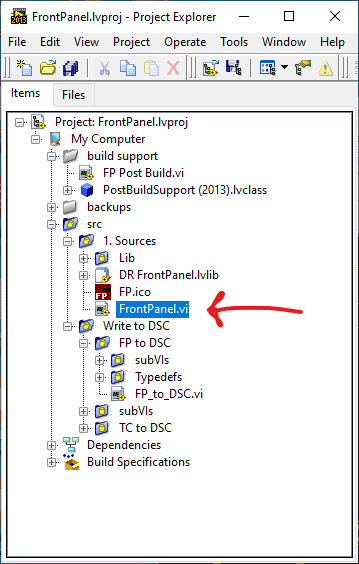
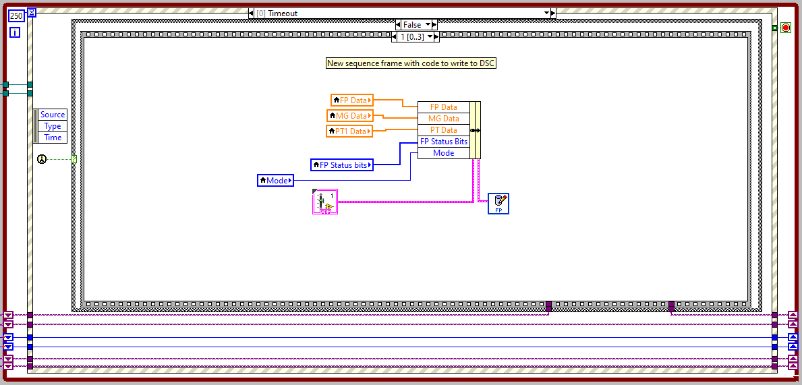
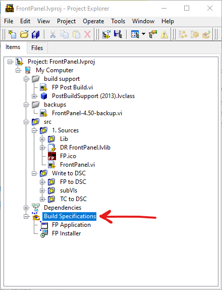

# How to contribute

Thanks for taking the time to contribute!

## How can I contrubute?

1. Submit bug reports or suggestions [here](https://github.com/levylabpitt/Leiden-FP/issues).
2. I want to submit code [What do I need to know?](#What-do-I-need-to-know)

## What do I need to know?

### Project structure

```
Leiden-FP
|
+---README.md
|
+---LICENSE
|
+---FrontPanel.lvproj           #LabVIEW project containing with Application and Installer Build Specifications
|
+---\src\
|   |
│   +---\1. Sources\            #Replace this folder when Leiden Cryogenics updates their source code
|   |   |
|   |   +---FrontPanel.vi
|   |   
│   +---\shared\                #Folder containing custom FrontPanel (and TC) code
|       |
│       +---\Inst.FP\           #Folder containing Inst.FP.lvclass
|           |
|           +---...             #See below how to modify FrontPanel.vi
| 
+---\backups\                   #Put backups of FrontPanel.vi here
|   |
|   +---FrontPanel-X-backup.vi  #Backup of version "X"
|
+---\build support\             
|   |
|   +---FP Post Build.vi        #Run to turn create a one file installer
|
+---\builds\Latest              #Find the latest single file installer files here

```

### Modify FrontPanel.vi

#### 1. Instantiate class and register for (placeholder) User Event


#### 2. Add frame in `"Start": Value Change` Event Case


#### 3. Modify `Timeout` Event Case to log data


#### 4. Add Event Case to handle `<Inst.FP Public Events.MessageFromProcess>: User Event`


#### 5. Stop and Destroy your custom SMO:


### Building a new version

1. Get new source files from Leiden Cryogenics
2. Unzip source file and find the "1. Sources" folder
3. *Replace* the "1. Sources" folder in "\Project\src\"


4. Open a backup copy of FrontPanel-X-backup.vi to see how to modify the new FrontPanel.vi




5. Save all
6. Increment version number and build the Application under "Build Specifications" in the Project Explorer
7. Increment version number and build the Installer under "Build Specifications" in the Project Explorer



8. Run "FP Post Build.vi" with version numbers matching the builds above


